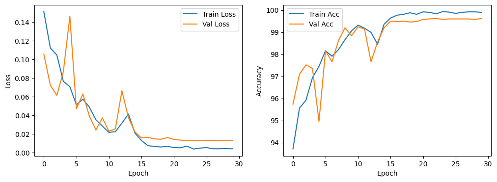

# Lung Cancer Detector


A machine learning-based project to detect lung cancer using medical imaging data. This repository contains code, datasets, and models to predict the likelihood of lung cancer from CT scans or X-ray images. The model achieves **98% accuracy** on the test set.

---

## Table of Contents
- [Introduction](#introduction)
- [Features](#features)
- [Installation](#installation)
- [Usage](#usage)
- [Dataset](#dataset)
- [Model Architecture](#model-architecture)
- [Results](#results)
- [Training and Validation Graph](#training-and-validation-graph)
- [Contributing](#contributing)
- [License](#license)
- [Acknowledgments](#acknowledgments)

---

## Introduction

Lung cancer is one of the leading causes of cancer-related deaths worldwide. Early detection is crucial for improving survival rates. This project leverages machine learning and deep learning techniques to analyze medical imaging data and provide a tool for early lung cancer detection.

The repository includes:
- Preprocessing scripts for medical imaging data.
- Deep learning models for lung cancer classification.
- Evaluation metrics to assess model performance.

---

## Features

- **Preprocessing**: Tools to clean, normalize, and augment medical imaging data.
- **Deep Learning Models**: Pre-trained and custom models for lung cancer detection.
- **Evaluation**: Metrics such as accuracy.
- **User-Friendly**: Easy-to-use scripts for training and inference.

---

## Installation

To set up the project locally, follow these steps:

1. **Clone the repository**:
   ```bash
   git clone https://github.com/yusufshihata/LungCancerDetector.git
   cd LungCancerDetector
   ```

2. **Create a virtual environment (optional but recommended)**:
   ```bash
   python -m venv venv
   source venv/bin/activate  # On Windows use 'venv\Scripts\activate'
   ```

3. **Install dependencies**:
   ```bash
   pip install -r requirements.txt
   ```

---

## Usage

### **Training the Model**
To train the lung cancer detection model, run:
```bash
python main.py train
```

### **Validating the Model**
To validate the trained model, run:
```bash
python main.py validate --model models/best_model.pth
```

### **Making Predictions**
To predict lung cancer from an image:
```bash
python main.py predict --model models/best_model.pth --image data/sample_image.jpg
```

---

## Dataset

The dataset consists of lung CT scan images labeled as either **cancerous** or **non-cancerous**. If the dataset is publicly available, provide the source:

- **Dataset Source:** [Kaggle](https://www.kaggle.com/datasets/andrewmvd/lung-and-colon-cancer-histopathological-images)
- **Preprocessing Steps:**
  - Resized all images to **224x224**.
  - Applied **normalization and augmentation**.
  - Split into **train, validation, and test sets**.

---

## Model Architecture

The model is based on a convolutional neural network (CNN) with the following architecture:

### Feature Extraction
The feature extraction part of the model is implemented as a sequence of convolutional layers, each followed by ReLU activation, max-pooling, and batch normalization.

1. **Conv2d (3 input channels, 32 output channels, kernel size 3, padding 1)**
   - ReLU activation
   - Max pooling with kernel size 2
   - Batch normalization for 32 output channels

2. **Conv2d (32 input channels, 64 output channels, kernel size 3, padding 1)**
   - ReLU activation
   - Max pooling with kernel size 2
   - Batch normalization for 64 output channels

3. **Conv2d (64 input channels, 128 output channels, kernel size 3, padding 1)**
   - ReLU activation
   - Max pooling with kernel size 2
   - Batch normalization for 128 output channels

4. **Adaptive Average Pooling (output size (6, 6))**
   - This operation reduces the spatial dimensions of the feature map to a fixed size of 6x6, regardless of the input size.

### Classifier
The classifier part of the model consists of fully connected layers:

1. **Linear (128 * 6 * 6 inputs, 512 outputs)**
   - ReLU activation
   - Dropout with probability 0.5 for regularization

2. **Linear (512 inputs, 3 outputs)**
   - This final linear layer produces the output with 3 classes.

---

## Results

| Metric    | Value  |
|-----------|--------|
| Accuracy  | 98%    |

---

## Training and Validation Graph

Below is the training and validation accuracy graph:



---
